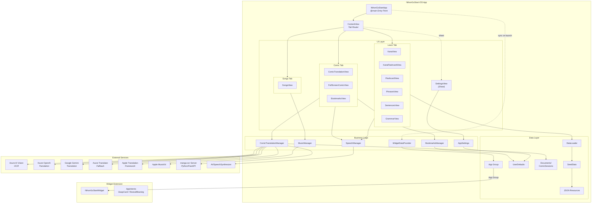

# NihonGoStart

A Japanese language learning iOS app built with SwiftUI.

## Features

### Learning
- **Kana** - Hiragana and katakana character charts organized by groups (basic, dakuon, handakuon, combo)
- **Kana Practice** - Flashcard-style practice with swipe navigation and tap-to-reveal romaji
- **Vocabulary** - Flashcard practice with kanji, kana, romaji, and English translations, organized by JLPT levels (N5-N1)
- **Phrases** - Common Japanese phrases categorized by situation, with audio pronunciation via text-to-speech
- **Sentences** - Example sentences organized by topic for learning grammar in context
- **Grammar** - Grammar guide covering particles, verb forms, adjectives, and more, organized by JLPT level and category

### Songs
- Apple Music integration for searching and playing Japanese music for listening practice
- Preview playback (30-second clips) for all users, full playback with Apple Music subscription
- Synchronized lyrics display with TTML parsing

### Comic Translation
- Upload manga/comic pages (images or PDFs)
- OCR extracts Japanese text using Azure AI Vision
- Optional manga-ocr backend for enhanced manga font recognition
- Translation via Azure OpenAI, Gemini, Azure Translator, or Apple Translation (fallback chain)
- Overlay mode shows translations directly on the image
- Audio pronunciation for extracted text
- Bookmark and save translated text
- Session persistence across app restarts

## Architecture

> For the full interactive diagram, open [`docs/architecture.drawio`](docs/architecture.drawio) in [draw.io](https://app.diagrams.net/).



**Translation Fallback Chain:** Azure OpenAI → Gemini → Azure Translator → Apple Translation

## Setup

### Requirements
- macOS with Xcode 15+
- iOS 17.4+ device or simulator (required for Translation framework)

### API Keys

Create `NihonGoStart/Secrets.swift` with:

```swift
import Foundation

enum Secrets {
    // Required: Azure AI Vision (for Comic Translation OCR)
    static let azureAPIKey = "YOUR_AZURE_VISION_API_KEY"
    static let azureEndpoint = "https://YOUR_RESOURCE.cognitiveservices.azure.com/"

    // Optional: Azure Translator (fallback translation)
    static let azureTranslatorKey = ""
    static let azureTranslatorRegion = ""

    // Optional: Azure OpenAI (preferred translation)
    static let azureOpenAIEndpoint = ""
    static let azureOpenAIKey = ""
    static let azureOpenAIDeployment = "gpt-4o-mini"

    // Optional: Gemini API (fallback translation)
    static let geminiAPIKey = ""

    // Optional: manga-ocr backend URL
    static let mangaOCREndpoint = ""
}
```

**Note:** `Secrets.swift` is git-ignored to protect your API keys.

### Apple Music Integration (Optional)

For the Songs feature, add your MusicKit credentials to `Secrets.swift`:
- `appleMusicTeamId` - Your Apple Developer Team ID
- `appleMusicKeyId` - Your MusicKit Key ID
- `appleMusicPrivateKey` - Base64-encoded .p8 private key

See `CLAUDE.md` for detailed setup instructions.

### Manga-OCR Backend (Optional)

The `manga-ocr-server/` directory provides a Python backend for specialized manga text recognition:

```bash
# Run locally
cd manga-ocr-server
pip install -r requirements.txt
uvicorn app:app --host 0.0.0.0 --port 8000

# Or with Docker
docker build -t manga-ocr-server .
docker run -p 8000:8000 manga-ocr-server
```

## Project Structure

```
NihonGoStart/
├── NihonGoStart/                    # Main iOS app source
│   ├── App/                         # App entry points
│   │   ├── NihonGoStartApp.swift    # App entry point (@main)
│   │   └── ContentView.swift        # Main tab container (Learn/Songs/Comic tabs)
│   │
│   ├── Models/                      # Data models
│   │   └── DataModels.swift         # All data models (VocabularyWord, GrammarPoint, etc.)
│   │
│   ├── Views/                       # UI views organized by feature
│   │   ├── Learning/                # Kana, Vocabulary, Phrases, Sentences, Grammar views
│   │   ├── Comic/                   # ComicTranslationView, BookmarksView
│   │   ├── Songs/                   # SongsView (Apple Music integration)
│   │   └── SettingsView.swift       # Settings sheet (dev mode toggle)
│   │
│   ├── Managers/                    # Business logic & API clients
│   │   ├── AppSettings.swift        # Dev mode toggle (UserDefaults)
│   │   ├── ComicTranslationManager.swift
│   │   ├── BookmarksManager.swift
│   │   ├── MusicManager.swift       # Apple Music integration (MusicKit)
│   │   └── SpeechManager.swift
│   │
│   ├── Shared/                      # Shared code (app + widget)
│   │   └── WidgetDataProvider.swift  # Widget data sync via App Groups
│   │
│   ├── Data/                        # Data loading utilities
│   │   ├── DataLoader.swift
│   │   └── SeedData.swift
│   │
│   ├── Resources/                   # Static JSON data files
│   │   ├── kana.json
│   │   ├── vocabulary.json
│   │   ├── phrases.json
│   │   ├── sentences.json
│   │   └── grammar.json
│   │
│   ├── Support/                     # Bridging header
│   ├── Secrets.swift                # API keys (git-ignored)
│   └── Assets.xcassets/             # App icons and colors
│
├── NihonGoStartTests/               # Unit tests
├── NihonGoStartUITests/             # UI tests
├── manga-ocr-server/                # Python backend for manga-ocr
└── docs/                            # Documentation
```

## Testing

```bash
# Run tests via Xcode: Cmd+U
# Or via command line:
xcodebuild test -scheme NihonGoStart -destination 'platform=iOS Simulator,name=iPhone 15'
```

## License

Private project.
